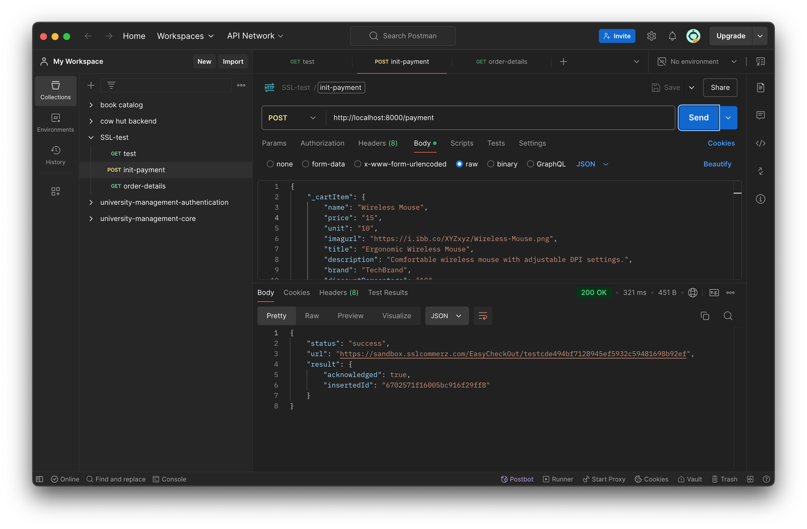
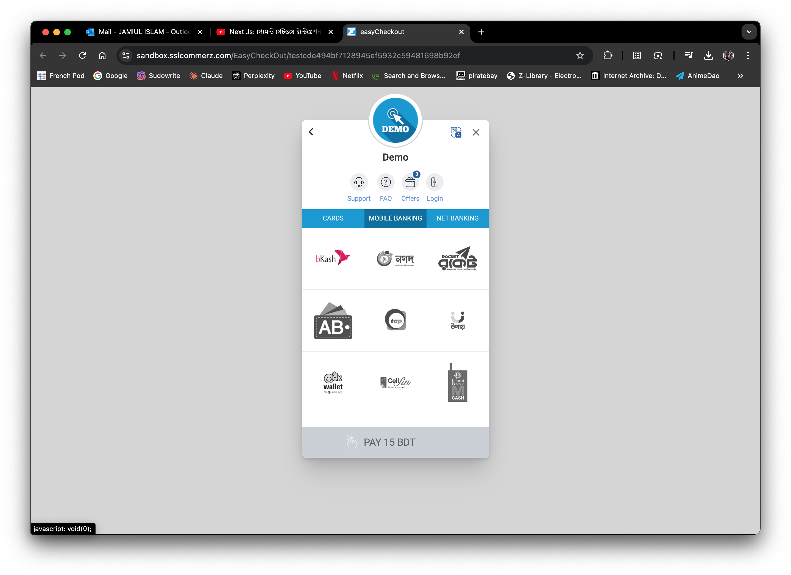
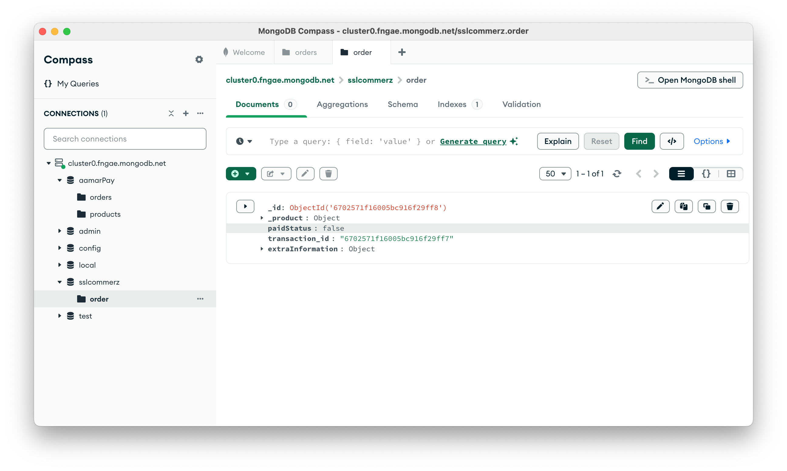
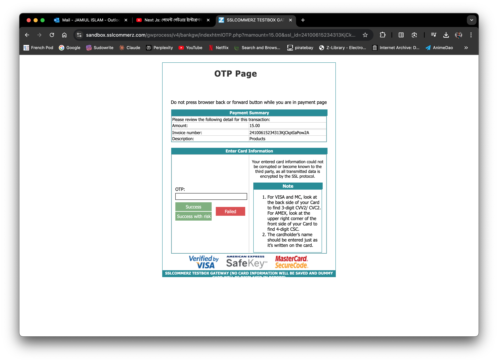
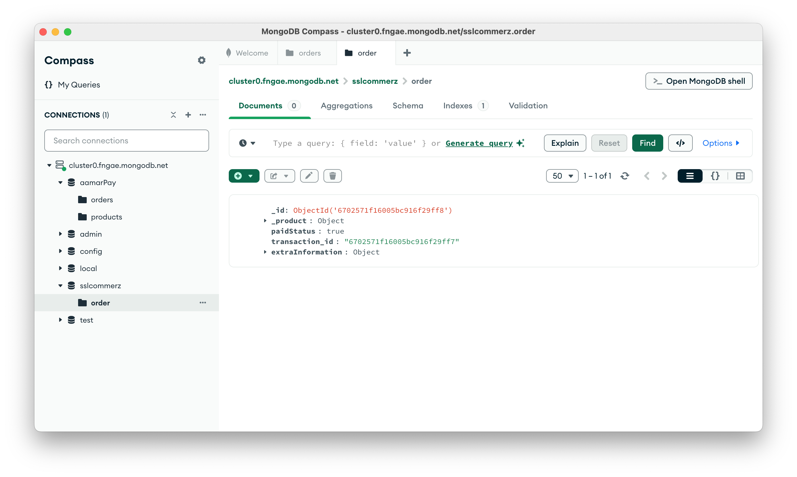

# SSLCommerz Payment Gateway Backend

A NodeJs Api that demonstrates an e-commerce payment gateway using SSLCommerz. The application uses Express.js for the server, MongoDB as the database, and SSLCommerz for payment processing.

## Table of Contents

- [Installation](#installation)
- [Usage](#usage)
- [Environment Variables](#environment-variables)
- [API Endpoints](#api-endpoints)

## Installation

To install the required dependencies, run the following command:

```bash
npm install
or
yarn install
```

## Usage

To start the server, run the following command:

```bash
npm run start
or
yarn dev
```

The server will start on port 8000.

## Environment Variables

The following environment variables are required:

```bash
STORE_ID            # unique sslcommerz store id
STORE_PASSWD        # unique sslcommerz store password
ISLIVE              # development or live status (true/false)
MONGODB_CONNECTION  # mongoDB connection uri
```

## Following steps

The following API endpoints are available:

```bash
 (POST) /payment:                     # Initiates a payment request
 (POST) /payment/success/:trans_id:   # Handles successful payments
 (POST) /payment/fail/:trans_id:      # Handles failed payments
 (GET) /order-details/:userId:        # Retrieves order details for a user
```

## Screenshots of API

- **Initiate Payment**



- **SSLCommerz Sandbox**



- **Order Created: Payment Status (pending)**



- **OTP confirmation**



- **Order Created: Payment Status (completed)**

